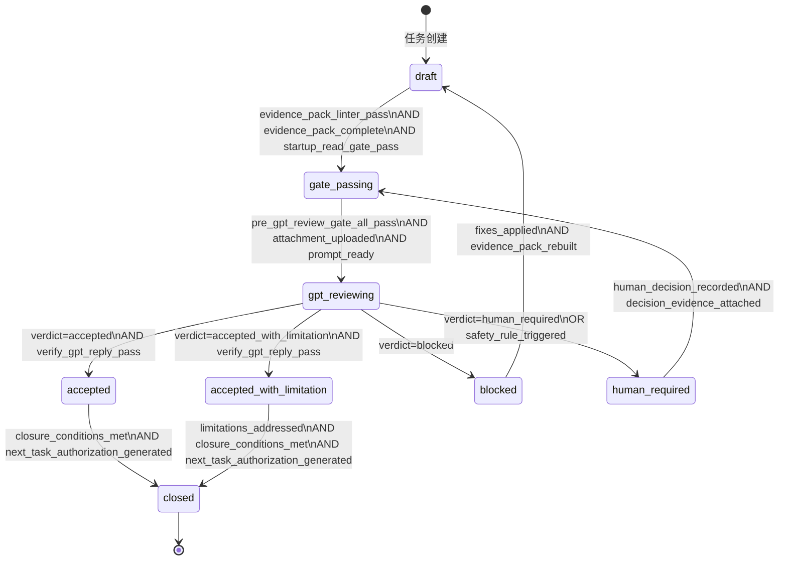

# PROCESS_STATE_MACHINE — GPT-Agent 交接流程状态机定义

---

## 任务信息

| 字段 | 值 |
|------|-----|
| **task_id** | `PROCESS-STATE-MACHINE-DEFINE-A1` |
| **run_id** | `PROCESS_STATE_MACHINE_DEFINE_A1_20260609T110000_RD` |
| **generated_at** | `2026-06-09T11:00:00+08:00` |
| **author** | Agent (QoderWork) |
| **authorization_source** | `HANDOFF-WORKFLOW-HARDENING-PLAN-A1-R2` verdict: `accepted_with_limitation`, next_task: `PROCESS-STATE-MACHINE-DEFINE-A1` |
| **hardening_plan_ref** | `HANDOFF_WORKFLOW_HARDENING_PLAN.md` section 5.1, section 7 task 1 |

---

## 一、概述

本文档定义了 GPT-Agent 自动化交接流程的正式状态机。状态机同时提供人类可读（本文件，含 Mermaid 状态图）和机器可读（`PROCESS_STATE_MACHINE.json`）两种格式。

所有自动化脚本、门禁检查器、审计工具应以此状态机为权威来源，判断任务当前所处的流程阶段以及允许的状态转换。

---

## 二、状态图（Mermaid）



---

## 三、状态定义

### 3.1 draft（草稿）

| 属性 | 描述 |
|------|------|
| **含义** | 任务已初始化，evidence pack 尚未完成或未通过 linter 检查 |
| **进入条件** | (1) 任务首次创建；(2) 从 `blocked` 状态回退（修正后重新提交） |
| **退出条件** | evidence pack 通过 `evidence_pack_linter.py` 检查，且所有必填文件完整，且 startup_read_gate PASS |
| **允许的操作** | 创建/修改 evidence pack 文件、运行 linter、生成 manifest |
| **不允许的操作** | 提交 GPT 审查、运行 pre_gpt_review_gate |

### 3.2 gate_passing（门禁通过中）

| 属性 | 描述 |
|------|------|
| **含义** | 正在通过 pre-GPT 门禁检查流程 |
| **进入条件** | evidence_pack_linter PASS AND evidence_pack_complete AND startup_read_gate PASS |
| **退出条件** | `pre_gpt_review_gate.py` 全部 PASS AND 附件已上传 AND prompt 已就绪 |
| **允许的操作** | 运行 pre_gpt_review_gate、上传附件、准备 prompt |
| **不允许的操作** | 跳过门禁直接提交 GPT、修改 evidence pack 内容 |

### 3.3 gpt_reviewing（GPT 审查中）

| 属性 | 描述 |
|------|------|
| **含义** | 已提交 GPT 审查请求（含附件），等待 GPT 响应 |
| **进入条件** | 门禁全部通过 AND 附件上传已确认 AND prompt 已发送 AND user_bubble 已确认 |
| **退出条件** | GPT 响应被 `verify_gpt_reply.py` 成功验证 |
| **允许的操作** | 等待 GPT 响应、capture 响应、运行验证器 |
| **不允许的操作** | 重新提交（需等待当前轮完成）、修改 evidence pack |
| **审查轮次限制** | 同一任务最多 3 轮。3 轮后仍为 `blocked` 则自动进入 `human_required` |

### 3.4 accepted（通过）

| 属性 | 描述 |
|------|------|
| **含义** | GPT 审查无条件通过 |
| **进入条件** | verdict = `accepted` AND `verify_gpt_reply.py` PASS |
| **退出条件** | 所有 closure 条件满足 AND next_task_authorization 已生成 |
| **允许的操作** | 生成 next_task_authorization、执行 closure binding |
| **不允许的操作** | 回退到 `gpt_reviewing`、修改 evidence pack |

### 3.5 accepted_with_limitation（有条件通过）

| 属性 | 描述 |
|------|------|
| **含义** | GPT 审查有条件通过，存在已知 limitation 但不阻塞 closure |
| **进入条件** | verdict = `accepted_with_limitation` AND `verify_gpt_reply.py` PASS |
| **退出条件** | limitation 被记录/处理 AND closure 条件满足 AND next_task_authorization 已生成 |
| **允许的操作** | 记录 limitation、生成 next_task_authorization、执行 closure binding |
| **不允许的操作** | 回退到 `gpt_reviewing`、忽略 limitation 直接关闭 |

### 3.6 blocked（阻塞）

| 属性 | 描述 |
|------|------|
| **含义** | GPT 审查拒绝，存在必须修复的 blocking issue |
| **进入条件** | verdict = `blocked` |
| **退出条件** | 修正所有 blocking issue 后回到 `draft`（evidence pack 需重建） |
| **允许的操作** | 分析 blocking issue、修正 evidence pack、重建并提交 |
| **不允许的操作** | 跳过 `draft` 直接到 `gate_passing` 或更远、忽略 blocking issue |

### 3.7 human_required（需人工介入）

| 属性 | 描述 |
|------|------|
| **含义** | 流程需要人工决策才能继续 |
| **进入条件** | verdict = `human_required` OR 安全规则触发（如 legacy 文件操作、部署决策） |
| **退出条件** | 人工决策已记录（使用 HUMAN_REQUIRED_DECISION_RECORD 模板）AND 决策证据已附加 |
| **允许的操作** | 等待人工输入、记录决策 |
| **不允许的操作** | 自动执行任何有副作用的操作、跳过人工决策继续流程 |

### 3.8 closed（已关闭）

| 属性 | 描述 |
|------|------|
| **含义** | 任务交接完成，verdict 已绑定 |
| **进入条件** | (accepted OR accepted_with_limitation) AND closure 条件全部满足 AND next_task_authorization 已生成 |
| **退出条件** | **终态，不可退出** |
| **允许的操作** | 只读查询、审计 |
| **不允许的操作** | 任何状态回退、修改 evidence pack、重新提交 GPT 审查 |

---

## 四、转换规则

### 4.1 完整转换表

| # | from | to | guard（前置条件） | evidence_required |
|---|------|-----|-------------------|-------------------|
| T01 | `draft` | `gate_passing` | `evidence_pack_linter_pass AND evidence_pack_complete AND startup_read_gate_pass` | 是 |
| T02 | `gate_passing` | `gpt_reviewing` | `pre_gpt_review_gate_all_pass AND attachment_uploaded AND prompt_ready` | 是 |
| T03 | `gpt_reviewing` | `accepted` | `verdict=accepted AND verify_gpt_reply_pass` | 是 |
| T04 | `gpt_reviewing` | `accepted_with_limitation` | `verdict=accepted_with_limitation AND verify_gpt_reply_pass` | 是 |
| T05 | `gpt_reviewing` | `blocked` | `verdict=blocked` | 是 |
| T06 | `gpt_reviewing` | `human_required` | `verdict=human_required OR safety_rule_triggered` | 是 |
| T07 | `accepted` | `closed` | `closure_conditions_met AND next_task_authorization_generated` | 是 |
| T08 | `accepted_with_limitation` | `closed` | `limitations_addressed AND closure_conditions_met AND next_task_authorization_generated` | 是 |
| T09 | `blocked` | `draft` | `fixes_applied AND evidence_pack_rebuilt` | 是 |
| T10 | `human_required` | `gate_passing` | `human_decision_recorded AND decision_evidence_attached` | 是 |

### 4.2 禁止转换（显式列表）

以下状态转换被**显式禁止**，任何自动化脚本检测到这些转换企图必须拒绝并报错：

| from | to | 禁止原因 |
|------|-----|----------|
| `closed` | 任何状态 | 终态不可回退 |
| `accepted` | `gpt_reviewing` | 已通过审查不可撤回 |
| `accepted_with_limitation` | `gpt_reviewing` | 已通过审查不可撤回 |
| `blocked` | `gate_passing` | 必须经过 `draft` 重建 evidence pack |
| `blocked` | `gpt_reviewing` | 同上 |
| `blocked` | `accepted*` | 必须先修正问题 |
| `draft` | `gpt_reviewing` | 不可跳过门禁检查 |
| `draft` | `closed` | 不可跳过审查直接关闭 |
| `gate_passing` | `accepted*` | 不可跳过 GPT 审查 |
| `gate_passing` | `closed` | 不可跳过 GPT 审查 |

---

## 五、不变式（Invariants）

以下不变式在任何时刻都必须成立：

### INV-01: closed 是终态

`closed` 状态不可退出。任何尝试从 `closed` 转换到其他状态的操作必须被拒绝。

### INV-02: gpt_reviewing 到 accepted* 必须经过验证器

`gpt_reviewing → accepted` 或 `gpt_reviewing → accepted_with_limitation` 的转换，必须以 `verify_gpt_reply.py` 返回 `valid: true` 为前提。未经验证的 verdict 不得被接受。

### INV-03: blocked 只能回到 draft

`blocked` 状态的退出路径唯一：`blocked → draft`。不得跳过 evidence pack 重建步骤。

### INV-04: human_required 必须有决策记录

在 `human_required` 状态下的任何操作，都必须有对应的 `HUMAN_REQUIRED_DECISION_RECORD`。无决策记录不得退出该状态。

### INV-05: 每次状态转换必须有 evidence

所有状态转换（T01-T10）都要求 `evidence_required: true`。转换发生时，必须记录：转换时间戳、触发条件、相关文件路径。

### INV-06: 审查轮次限制

同一任务（同一 task_id）的 GPT 审查提交次数不得超过 3 轮。3 轮后仍为 `blocked` 的任务自动进入 `human_required` 状态。

### INV-07: next_task_authorization 传递

任何任务进入 `closed` 状态前，必须生成 `next_task_authorization` 记录，包含：下一个任务 ID、授权来源、授权时间戳。无有效授权记录的任务不得进入 `closed`。

### INV-08: 合法状态集合

任务的当前状态必须是以下八个状态之一：`draft`、`gate_passing`、`gpt_reviewing`、`accepted`、`accepted_with_limitation`、`blocked`、`human_required`、`closed`。任何不在此集合中的状态值视为非法。

---

## 六、安全门禁

### 6.1 强制验证点

| 转换 | 验证器 | 验证内容 |
|------|--------|----------|
| T01 (draft→gate_passing) | `evidence_pack_linter.py` + `startup_read_gate.py` | evidence pack 完整性 + 启动证明完整性 |
| T02 (gate_passing→gpt_reviewing) | `pre_gpt_review_gate.py` | 提交前全部门禁 PASS |
| T03/T04 (gpt_reviewing→accepted*) | `verify_gpt_reply.py` | GPT 回复结构完整性 + run_id 匹配 |
| T07/T08 (accepted*→closed) | `validate_workflow_closure.py` | closure 条件 + next_task_authorization |

### 6.2 fail-closed 原则

所有验证器遵循 fail-closed 原则：验证失败默认拒绝（视为 `blocked`），不得默认通过。

### 6.3 反篡改约束

- GPT verdict 不可伪造或补造
- evidence pack 在 `gpt_reviewing` 及之后状态不可修改（SHA-256 锁定）
- 状态转换记录不可删除或覆盖

---

## 七、next_task_authorization 机制

### 7.1 授权传递流程

```
当前任务进入 accepted/accepted_with_limitation
    → GPT verdict 中包含 next_task_authorization 字段
    → verify_gpt_reply.py 验证该字段存在
    → 从 verdict 中提取 next_task_id
    → 生成授权记录（JSON）
    → 下一个任务创建时验证授权记录存在
    → 无授权 → 不允许进入 gate_passing
```

### 7.2 授权记录格式

```json
{
  "authorization_id": "AUTH-{task_id}-{next_task_id}",
  "source_task_id": "HANDOFF-WORKFLOW-HARDENING-PLAN-A1-R2",
  "source_verdict": "accepted_with_limitation",
  "authorized_task_id": "PROCESS-STATE-MACHINE-DEFINE-A1",
  "authorized_at": "2026-06-09T10:12:30+08:00",
  "authorization_source": "gpt_verdict_next_task_authorization",
  "evidence_ref": "_reports/handoff-workflow-hardening-plan-a1/GPT_REVIEW_RECORD_R2.json"
}
```

### 7.3 验证规则

- `gate_passing` 入口检查：验证 `authorized_task_id` 匹配当前 task_id
- `authorization_source` 必须是已验证的 GPT verdict 记录路径
- 授权记录不可被后续任务修改

---

## 八、与 CHANGED_FILES_SCHEMA 的集成

每次状态转换涉及的 evidence 文件变更，应使用 `CHANGED_FILES_SCHEMA.json` 标准格式记录。具体集成点：

| 转换 | changed_files 记录内容 |
|------|----------------------|
| T01 (draft→gate_passing) | evidence pack 文件的创建/修改记录 |
| T09 (blocked→draft) | 修正涉及的文件变更记录 |
| T07/T08 (accepted*→closed) | closure binding 产生的文件变更记录 |

---

## 九、自动化脚本集成指南

### 9.1 状态查询

```python
import json

with open('PROCESS_STATE_MACHINE.json', 'r', encoding='utf-8') as f:
    sm = json.load(f)

def get_valid_transitions(current_state: str) -> list:
    """返回从当前状态出发的所有合法转换。"""
    return [t for t in sm['transitions'] if t['from'] == current_state]

def is_valid_transition(from_state: str, to_state: str) -> bool:
    """检查 from→to 是否为合法转换。"""
    return any(t['from'] == from_state and t['to'] == to_state
               for t in sm['transitions'])

def get_guard(transition_id: str) -> str:
    """返回指定转换的 guard 条件。"""
    for t in sm['transitions']:
        if t['id'] == transition_id:
            return t['guard']
    raise ValueError(f'transition {transition_id} not found')
```

### 9.2 状态验证

```python
def validate_state_transition(task_state: dict, target_state: str) -> dict:
    """验证状态转换的合法性。返回验证结果。"""
    current = task_state.get('current_state')
    if current not in [s['name'] for s in sm['states']]:
        return {'valid': False, 'error': f'unknown current state: {current}'}

    if not is_valid_transition(current, target_state):
        return {'valid': False, 'error': f'illegal transition: {current} → {target_state}'}

    # Check invariants
    if current == 'closed':
        return {'valid': False, 'error': 'INV-01: closed is terminal'}

    return {'valid': True, 'transition': f'{current} → {target_state}'}
```

---

## 十、审计检查清单

| 检查项 | 验证方法 |
|--------|----------|
| 所有状态转换是否在 T01-T10 范围内 | 遍历转换日志，逐条检查 `is_valid_transition()` |
| closed 状态是否被尝试回退 | 搜索转换日志中 `from=closed` 的记录 |
| gpt_reviewing→accepted* 是否经过验证器 | 检查每次 T03/T04 转换是否有对应的 `verify_gpt_reply.py` PASS 记录 |
| blocked→draft 是否为唯一退出路径 | 搜索 `from=blocked` 且 `to≠draft` 的记录 |
| human_required 是否有决策记录 | 检查每次 T10 转换是否有 HRD 文件引用 |
| 审查轮次是否超限 | 统计同一 task_id 的 `gpt_reviewing` 进入次数 |
| next_task_authorization 是否完整 | 检查每次 T07/T08 转换是否有授权记录 |

---

*文档生成时间: 2026-06-09T11:00:00+08:00*
*Task ID: PROCESS-STATE-MACHINE-DEFINE-A1*
*Run ID: PROCESS_STATE_MACHINE_DEFINE_A1_20260609T110000_RD*
